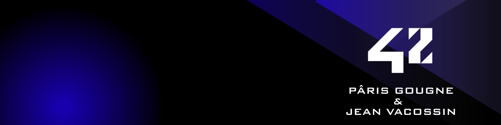

_This project has been created as part of the 42 curriculum by pgougne, jvacossi._



# Description

## Introduction

First released in 1980 by Namco, Pac-Man quickly became a cultural icon and one of
the most influential video games of all time. Designed by Toru Iwatani, its goal was to
create a game that could appeal to women and casual players, contrasting with the space
shooters of the era. The game introduced the now-famous ghost AI, each with unique
behaviors (Blinky chases, Pinky ambushes, Inky is unpredictable, and Clyde is. . . weird).\
Pac-Man was also the first game to popularize the concept of a power-up — the Pacgum
(or Power Pellets) that lets you eat the ghosts. The original arcade machine had 256
levels, but due to an integer overflow bug, level 256 was impossible to finish, known as
the infamous “kill screen”.

## Project

This project is about making our version of Pac-Man. We decided to make a Pac-Man in 3D with a top-down view, featuring realistic ghost visuals against a custom-rendered yellow sphere for Pac-Man. Navigating through intricate 3D mazes with Ursina, the player moves across multiple levels, dodging four unique ghosts while collecting pacgums and high-value super-pacgums. Eating a super-pacgum briefly turns the tables, allowing Pac-Man to hunt down vulnerable ghosts for extra points before they respawn in their corners. The gameplay experience includes a live HUD tracking score, remaining lives, and level timers, many menus like pause, menu, leaderboard... To complete the experience, the game features a persistent top-10 highscore system where players can record their names, as well as a dedicated cheat mode offering invincibility, speed boosts, and level skips and many others to explore every aspect of the game.

# Instructions

This project use UV

To run the project, you must install all the dependencies
> make install

and then:
> make run

to check the type-hint
> make lint

to check the type-hint with strict flag
> make lint-strict


It was mandatory to delivered on Itch.io the packaged game. So here is the link and the password to access to the game online:
# ICI EXPLIQUE ITCH.IO

# Resources
https://www.ursinaengine.org/\
https://www.ursinaengine.org/documentation.html\
https://www.ursinaengine.org/api_reference.html

How AI was used ?
Ai was used throughout this project as a support and learning assistant.

- Debugging:

  -  Explain unexpected behaviors
  - Suggest potential causes of bugs

- Understanding Ursina:

  - Get some example
  - Complet the thin documentation of Ursina

- Global Assistance:

  - Clarify architectural decisions
  - Discuss best practices in project structure

# Configuration

By default, the configuration data are stored in config/config.json and the file must contain some of requiered data:

|      Data      |      Type      |     Usage      |    Requiered   |
|:--------------:|:--------------:|:--------------:|:--------------:|
|  highscore_filename  |  str  |  The path of the highscore file  |  Yes  |
|  levels  |  List[int, int]  |  The width and heigh for each level, must be at least 10 levels  |  Yes  |
|  lives  |  int  |  The number of lives for the whole game  | No, default 3 lives   |
|  points_per_pacgum  |  int  |  Number of score earned for each pacgum  |  No, default 10   |
|  points_per_super_pacgum  |  int  |  Number of score earned for each super pacgum  |  No, default 50  |
|  points_per_ghost  |  int  |  Number of score earned for each ghost eaten  | No, default 200  |
|  seed  |  int  |  The seed is only usefull for the first level, it will always be the same with the same width and heigh |  Yes  |
|  level_max_time  |  int  |  The time to complet a level |  No, default 90  |

It looks like this: 
```
{
  "highscore_filename": "config/highscores.json",
  "levels": [
    {
      "width": 6,
      "height": 6
    },
    {
      "width": 6,
      "height": 6
    },
    {
      "width": 6,
      "height": 6
    },
    {
      "width": 6,
      "height": 6
    },
    {
      "width": 6,
      "height": 6
    },
    {
      "width": 6,
      "height": 6
    },
    {
      "width": 6,
      "height": 6
    },
    {
      "width": 6,
      "height": 6
    },
    {
      "width": 6,
      "height": 6
    },
    {
      "width": 6,
      "height": 6
    }
  ],
  "lives": 3,
  "points_per_pacgum": 10,
  "points_per_super_pacgum": 50,
  "points_per_ghost": 200,
  "seed": 42,
  "level_max_time": 90
}
```

# Highscore

The highscore file in by default in config/highscores.json

It is a list (named "scores"),
with 3 differents data in each score:
|      Data      |      Type      |     Usage      |
|:--------------:|:--------------:|:--------------:|
|  name  |  str  |  The name of the player  |
|  score  |  int  |  The final score  |
|  date  |  str  |  The date of the game  |

```
{
  "scores": [
    {
      "name": "jean",
      "score": 1544,
      "date": "2026-07-09T14:11:03.849052"
    },
    {
      "name": "paris",
      "score": 266,
      "date": "2026-07-06T16:16:15.249185"
    },
    {
      "name": "g fini",
      "score": 144,
      "date": "2026-07-09T10:00:40.293904"
    },
    {
      "name": "johhny",
      "score": 144,
      "date": "2026-07-09T13:50:08.173526"
    },
    {
      "name": "jean",
      "score": 144,
      "date": "2026-07-09T14:05:29.052111"
    },
    {
      "name": "johnny",
      "score": 72,
      "date": "2026-07-08T17:25:33.465249"
    },
    {
      "name": "jean",
      "score": 20,
      "date": "2026-07-20T09:37:00.372607"
    },
    {
      "name": "pacman",
      "score": 2,
      "date": "2026-07-20T09:29:22.376250"
    },
    {
      "name": "0123456789",
      "score": 2,
      "date": "2026-07-20T09:37:43.024707"
    },
    {
      "name": "lala lala",
      "score": 2,
      "date": "2026-07-20T09:44:16.662490"
    }
  ]
}
```

# Maze Generation
The maze generation was pretty simple, we only had to create a MazeGenerator() class, than the generated hexadecimal maze is translated into a map of nodes with the wall data in it. And then it is displayed in the scene.

> Hexadecimal Maze: [[9, 3, 9, 5, 1, 3], [8, 6, 8, 1, 2, 14], [8, 1, 0, 4, 4, 3], [10, 14, 8, 5, 3, 10], [8, 3, 10, 11, 12, 2], [12, 4, 4, 4, 5, 6]]

> Nodes map: {(0, 0): Node (0, 0), (1, 0): Node (1, 0), (2, 0): Node (2, 0), (3, 0): Node (3, 0), (4, 0): Node (4, 0), (5, 0): Node (5, 0), (0, 1): Node (0, 1), (1, 1): Node (1, 1), (2, 1): Node (2, 1), (3, 1): Node (3, 1), (4, 1): Node (4, 1), (5, 1): Node (5, 1), (0, 2): Node (0, 2), (1, 2): Node (1, 2), (2, 2): Node (2, 2), (3, 2): Node (3, 2), (4, 2): Node (4, 2), (5, 2): Node (5, 2), (0, 3): Node (0, 3), (1, 3): Node (1, 3), (2, 3): Node (2, 3), (3, 3): Node (3, 3), (4, 3): Node (4, 3), (5, 3): Node (5, 3), (0, 4): Node (0, 4), (1, 4): Node (1, 4), (2, 4): Node (2, 4), (3, 4): Node (3, 4), (4, 4): Node (4, 4), (5, 4): Node (5, 4), (0, 5): Node (0, 5), (1, 5): Node (1, 5), (2, 5): Node (2, 5), (3, 5): Node (3, 5), (4, 5): Node (4, 5), (5, 5): Node (5, 5)}

# Implementation

Before the changes in the subject, it wasn't clear about the visualisation library to use, so we decided to use Ursina to make a 3d top down view of the pac-man game.

Each ghosts have a different behaviour, blinky (red) want to reach your position, another two nodes in front of you, and the two others are going 2 nodes on your left or your right. They change the chase mode to Random mode in a fix time. If you eat a super pacgum, they try to escape from you and when you eat then they go back to their spawn.

Cheats:

|      Name      |      Behaviour      |     Key      |
|:--------------:|:--------------:|:--------------:|
|  Freeze Ghost  |  ghost stop mooving  |  z  |
|  Infinite Lives  |  you get 9999999999999999 lives  |  x  |
|  Double Speed  |  Your speed double  |  v  |
|  Invincibility  |  You cannot be touch by ghost but you can eat them with a super pac-gum  |  b  |
|  All cheats  |  You get all the previous cheats  |  c  |

# General Software Architecture

# Project Management
